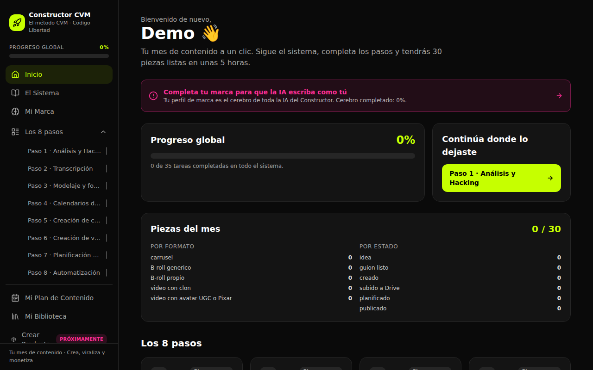

# Constructor CVM · Código Libertad

Código fuente del frontend de **Constructor CVM** (https://libertad-content-lab.base44.app), reconstruido a partir del bundle publicado en Base44 y organizado como proyecto Vite + React + Tailwind.



## Arranque

```bash
cp .env.example .env
npm install
npm run dev
```

## Arquitectura

- **Frontend (este repo):** React 18, React Router 6, Tailwind 3, lucide-react.
- **Backend:** sigue siendo Base44 (`@base44/sdk`) sobre la app `6abfaf6367b251a57a5130d0`. Este repo usa los mismos datos, la misma auth y las mismas funciones que la app publicada.

### Entities de Base44 que usa la app

| Entity | Operaciones | Dónde |
| --- | --- | --- |
| `BrandProfile` | list, create, update | Mi Marca, Inicio, Ajustes |
| `ContentPiece` | list, create, update | Inicio, Constructor de carruseles, Ajustes |
| `Resource` | list, create, update, delete | Mi Biblioteca, pasos, carruseles |
| `StepProgress` | list, filter, create, update | Progreso de los 8 pasos |
| `MonthlyArchive` | list, create, delete | Ajustes (archivo mensual) |

### Funciones backend (viven en Base44, no están en este repo)

- `aiMarca`: genera o completa el "cerebro" de marca (`src/pages/Marca.jsx`).
- `aiCarrusel`: crea, optimiza y modela carruseles y hooks (`src/components/carruseles/*`).
- Integración `Core.UploadPrivateFile` para subir archivos (`src/components/forms/FileUploader.jsx`).

## Estructura

```
src/
  api/base44Client.js        cliente del SDK
  lib/                       steps (los 8 pasos), constantes, auth, utils
  hooks/useProgress.js       progreso global/por paso
  components/
    layout/                  Sidebar + AppLayout
    steps/                   StepLayout (checklist, herramientas, recursos), ComingSoon
    carruseles/              fórmula, banco de hooks, crear/optimizar, resultado
    forms/                   ListField, RepeaterField, FileUploader
  pages/                     Inicio, Sistema, Marca, Plan, Biblioteca, Producto, Ajustes,
                             ConstructorCarruseles, pasos/Paso1..8, auth/*
```

## Limitaciones conocidas

- Los nombres de **variables locales** dentro de los componentes (`e`, `t`, `n`…) vienen del minificado. Los componentes, módulos y constantes sí tienen nombres legibles. Se pueden renombrar poco a poco al tocar cada archivo.
- Las pantallas de login, registro y recuperación de contraseña, junto con los toasts, se han reescrito: eran código de plantilla de Base44, no lógica de la app.
- Para salir de Base44 del todo hay que migrar las 5 entities y las 2 funciones (`aiMarca`, `aiCarrusel`) a otro backend (p. ej. Supabase + Claude API) y sustituir `src/api/base44Client.js`.
